## Laporan Praktikum 2

|  | Pemrograman Berbasis Framework 2025 |
|--|--|
| NIM |  244107027011|
| Nama |  Rayhan Pradana Putra Nugraha |
| Kelas | TI - 4K RPL |
 
# PRAKTIKUM 
## Membuat komponen, menggunakan JSX, Menggunakan Props, Menggunakan State

App.js

 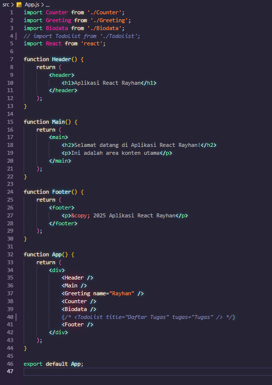

Counter.js

 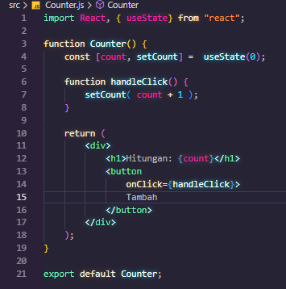

Greeting.js

 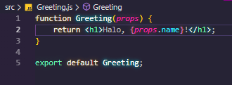

Biodata.js

 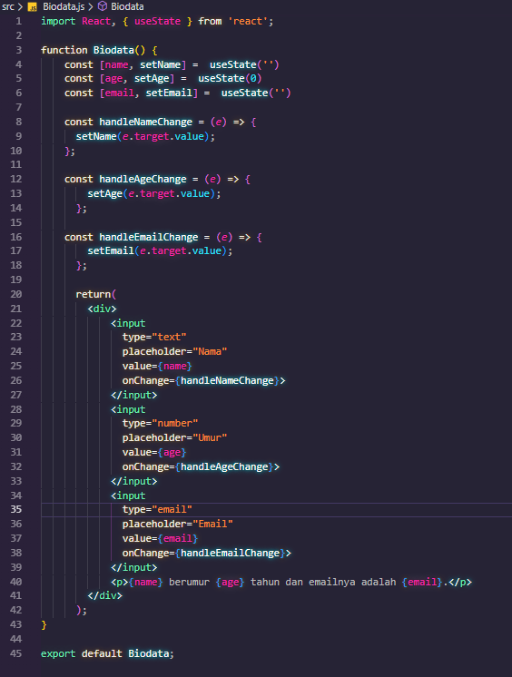

Hasil

 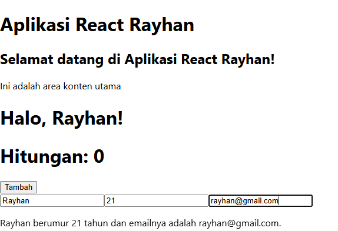

# Tugas
## 1. Buat komponen baru bernama TodoList yang menampilkan daftar tugas (todo list). Gunakan state untuk mengelola daftar tugas dan props untuk mengirim data tugas ke komponen anak. 

Komponen Todolist

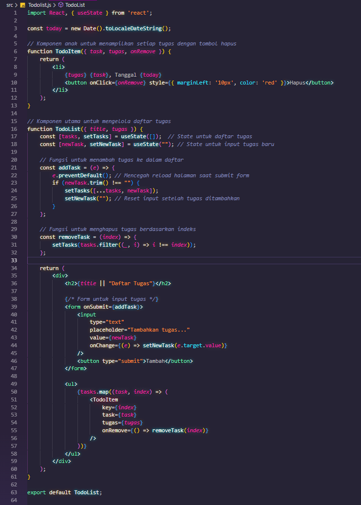

Pemanggilan pada App

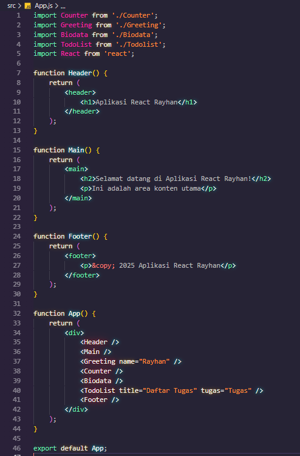

## 2. Tambahkan fitur untuk menambahkan tugas baru ke dalam daftar menggunakan form input. 

Penambahan tugas baru ke daftar

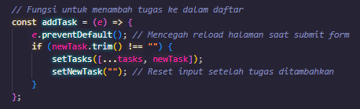

## 3. Implementasikan fitur untuk menghapus tugas dari daftar. 

Implementasi hapus

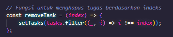

## Hasil

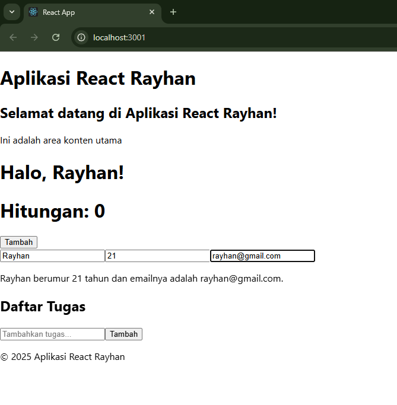
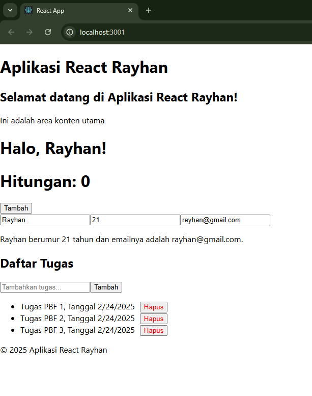
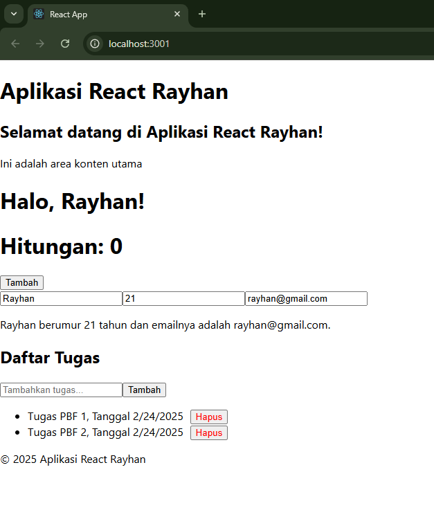

